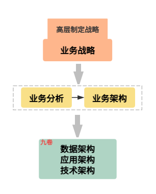
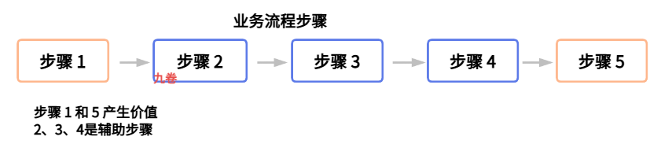
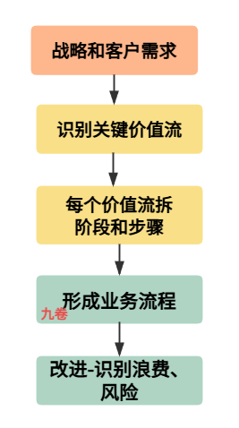
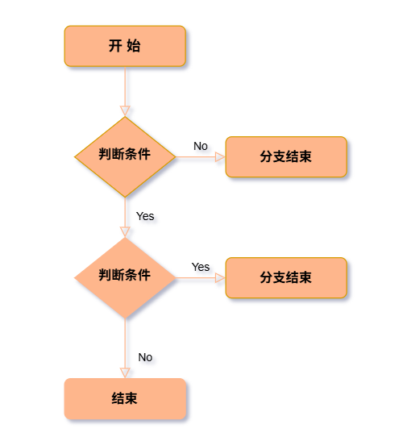
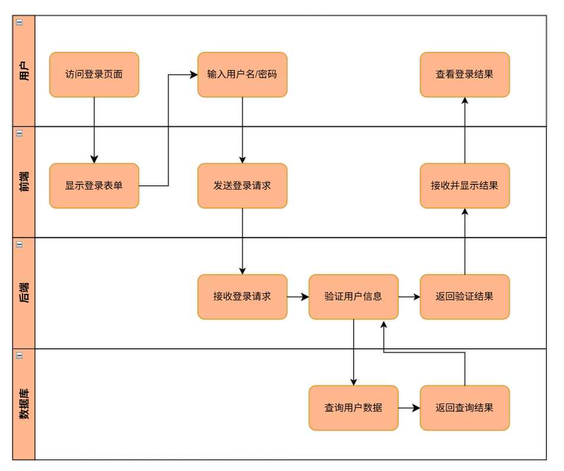
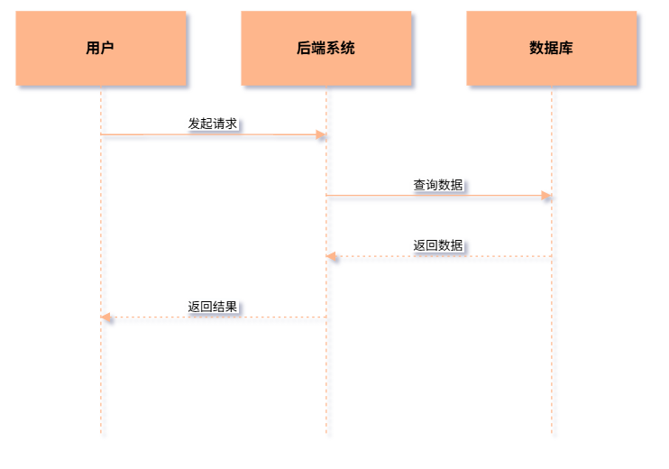

## 前言

业务其实是一个很大的概念，比如公司里有各种业务活动，大公司里有业务群组。

平常在公司里，员工做的各种各样的工作，都可以抽象为公司的业务活动，为实现公司商业目标而进行的各种工作。

业务就是各行各业中需要处理的一系列事务或活动，公司业务的最终的目是卖出产品换取利润，因此也可以说业务就是进行或处理商业上相关的活动。

## 什么是业务

业务（Business）是指公司或组织为了实现目标而进行的一系列**创造价值的活动或事务**。

包括研发与开发、销售、营销、渠道、运营、客户服务、财务管理等各个环节，其本质是围绕产品或服务，通过资源整合，与客户进行交易，最终带来利润的系统化工作。

理解业务的几个要素：

- 目标性：所有业务活动都有明确的目标，如商业目标的盈利、获取市场份额等；进行业务活动都是为了解决用户需求或社会问题。
- 价值创造：通过整合资源（人力、技术、资金、其它资源）形成产品或服务。
- 价值传递：也及是交易与交付，将产品/服务交付给客户，客户付报酬，公司或组织从中获取利益。
- 系统性：包括产品开发、市场营销、运营、客户服务、财务管理等多个相互关联的环节组成。

不同场景视角下对业务的理解：

- 商业视角：指公司为实现商业目标而进行的一系列相关活动。
- 销售视角：业务常指为获取订单、销售产品、获取客户，以及所从事的活动。
- 架构视角：比如互联网电商系统，电商业务系统的业务有下单、支付、退款等具体的流程活动。

可以看到在不同场景或视角下对业务的理解也不同，不仅各个行业下有不同的业务系统，不同公司里也有不同的业务活动。

那怎么做业务分析？不同视角下肯定有不同的方法。

为了有一个统一的视角，我们把它收敛到企业架构这个视角下，来进行业务相关的分析、架构等各种活动。

## 什么是企业架构

在我前面的文章中 [了解企业架构EA(Enterprise Architecture)](https://www.cnblogs.com/jiujuan/p/16871889.html)  ，对企业架构内容有一个介绍，可以去看看。这里做一个简单说明。

维基：

> 企业架构（Enterprise Architecture，EA，或企业体系结构）是在信息系统架构设计与实施的实践基础上发展起来的一个特殊领域，现有的实践，主要来自大型组织，例如政府建设。
>
> - 关于一般性的企业或组织；涉及企业建模基本要素及其相互关系或结构、结构准则；实施整个企业生命周期的治理；能够从企业战略、业务模式与系统或组织建设角度结合、运用信息技术的部门或职能；

百度百科：

> 企业架构（Enterprise Architecture，简称EA）是为企业信息系统提供通用解决方案的业务导向型框架，涵盖业务架构与IT架构两大分类，强调基于架构的集成而非部件的集成，以解决复杂系统整合问题。

一句话总结下，企业战略目标来说：

> 企业架构就是将企业的战略目标转化为可落地的 IT 实现的一整套逻辑与方法。

下面是企业架构简图：

一般公司高层进行公司战略设计，下面的中高层管理或架构师比如业务架构师、系统架构师等根据公司的战略设计，来进行业务分析和业务架构设计，最后是IT系统架构师进行应用架构、数据架构等架构设计。

最后技术架构，可能由某一技术架构师进行IT技术架构，设计完后，由程序开发完成代码编写，测试完成测试，运维部署应用代码，上线运营。

> 不过一般中小型公司架构师分工没有这么细，业务分析和应用架构的工作可能由产品经理来完成，输出产品应用架构，然后再由技术经理或技术leader来完成技术相关的架构工作，由他们兼任来完成这部分工作，或简单做一下架构设计工作，很快的分配任务做产品功能开发。

## 企业架构TOGAF下业务分析

在企业架构（Enterprise Architecture, EA）的语境下，业务分析不再是单纯地看一个功能或一个App，而是将企业视为一个复杂的有机体，分析其战略、组织、流程、信息与技术之间的协同关系。这个是对企业架构整体分析。

在企业架构里，典型的 TOGAF 框架，从 **战略层 - 能力层 - 流程层 - 组织层** 4 个层面来进行企业架构的系统分析。

- 战略层：

  - 1、愿景分析，明确企业未来 3 到 5 年要做成什么？

  - 2、目标分解，将宏观战略分解为可衡量可执行的业务目标。

- 能力层：

  - 1、业务能力：关注企业能做什么，这个不会随组织频繁变化。业务能力如：获客能力、风控能力、供应链调度能力。这个是 EA 的核心。一般会梳理出企业的业务能力地图。

  - 2、能力差距分析：现有能力（As-Is）与目标能力（To-Be）之间的差距在哪里？

- 流程层：

  - 1、价值流：为利益相关者交付价值的端到端路径。精益开发中的价值流图，或价值链模型进行相关分析。

  - 2、流程梳理：梳理出业务步骤，然后绘制业务流程图。

- 组织层：

  - 1、分析组织结构、岗位职责与业务能力之间的匹配度，确保有人负责、有权执行。

企业架构 TOGAF 业务分析过程：

> 目标确定→主干架构设计→目标设计→差距分析→能力识别→评审优化

- **（1）确定架构目标与范围**：明确业务架构的驱动因素（如国家政策、对标友商、企业战略），定义业务架构的覆盖范围（涉及哪些部门、客户、合作伙伴）。例如，某银行因监管要求需提升风险管控能力，其业务架构目标可设定为建立全流程风险管控体系。

- **（2）开发主干业务架构**：通过访谈管理层、调研行业趋势、分析现有系统，梳理企业当前的业务功能、流程、组织结构和数据。例如，某制造企业的主干业务架构可能包括“生产计划、采购、仓储、销售”等核心功能，以及“订单处理流程”“生产调度流程”等主干流程。

- **（3）开发目标业务架构**：基于战略目标，设计未来业务蓝图，包括有哪些**业务功能（做什么）、业务流程（怎么做）、组织结构（谁来做）、业务数据（用什么支撑）**。定义未来一年或几年要做的业务目标和任务。例如，某制造企业的目标业务架构可能新增全渠道销售功能，优化库存管理流程，并建立客户数据中台。

- **（4）差距分析与能力识别**：对比主干与目标业务架构，识别“能力增量”（即需要新增或提升的业务能力）。例如，上面的增加全渠道销售功能，可能不仅是线下销售渠道，也要建立线下线上的一体化销售渠道，那就要增加电商方面的渠道。

- **（5）评审与优化**：组织干系人（管理层、业务部门、IT部门）评审业务架构，确保其符合战略目标与企业实际，调整优化后形成最终的业务架构蓝图。

## 用价值流和业务流程做业务分析

### 什么是价值流和业务流程

价值流这个概念最早是精益生产里的，企业架构TOGAF 借鉴过来。

价值流原指产品从原材料到成品交付所需全部活动，涵盖增值与非增值环节，由丰田公司在推行精益生产时提出并使用价值流程图（VSM，value stream mapping）作为分析工具，优化流程，消除浪费和流程中的瓶颈。

> 什么是价值流？
>
> 而对于 IT 和互联网业务来说，价值流是指一系列能够为客户或相关利益方创造价值的关键活动集合。它可能从一个需求或问题出发到交付价值的端到端步骤与流程。它可以通过多个步骤和阶段，逐步积累价值，最终实现整个业务流程的闭环。
>
> 最终是给客户和利益相关者创造价值，避免浪费。是从一个外部和客户视角。

> 什么是业务流程？
>
> 业务流程是由不同参与者协作完成、以创造客户价值为目标的结构化活动集合。不同活动或步骤是点，把这些点串联起来就组成了流程。公司内部执行视角，由谁、按什么顺序、什么规则、什么步骤来做。把价值流分解为更细、更易执行的步骤。

咋一看，两者都差不多啊，都是创造价值的活动集合和链接。有什么区别吗？

价值流分析和业务流程分析的区别：

| **价值流分析 (VSM)**                       | **业务流程分析 **                               |
| ------------------------------------------ | ----------------------------------------------- |
| 外部/客户视角：客户如何获得价值？          | 内部/执行视角：工作如何被完成？创造价值的过程。 |
| 高层级：关注端到端流程的关键阶段，交付链。 | 低层级：具体的活动、步骤和流程。                |
| 消除浪费，缩短交付周期（Lead Time）。      | 提高效率，确保操作合规与标准化。                |

### 两者相结合分析业务

> 从产生价值的角度来进行业务分析。然后结合业务流程来做更细致的实施。

两者结合分析业务的步骤：

- 1. 先画价值流图：对客户或利益相关者产生价值的关键节点、关键价值阶段和步骤。
- 2. 再画业务流程图：要产生这些价值，需要哪些步骤、活动来完成这些关键价值。拆解价值流为具体的操作步骤、阶段和流程。
- 3. 最后是改进：业务流程里哪些是必须的步骤，产生价值的增值活动，哪些步骤可以去掉和合并，找出流程中浪费和瓶颈的地方，进行改进。

比如电商的商品下单到到公司现金入账的价值流：

- 起点：客户提交订单；终点：客户收到货物完成订单支付，公司确认收入。

- 端到端流程所流经的步骤：订单受理、库存处理、支付处理、拣货打包、物流发货、签收确认、发票核对、收入入账。这些步骤串联起来就是一条下单到公司入账的业务流程。

  

**怎么识别关键价值流，问 3 个问题**：

1、这条价值流是否直接决定客户满意度和收入？

2、是否支撑公司的核心战略目标？

3、是否是当前痛点或风险最集中的地方？

> 找出对客户或用户有价值的问题、需求，可能需要反复思考，不断头脑风暴，不算试错，产品多次改进才能找到问题与解决方案匹配（PSF，Problem Solution Fit）。

怎么拆分价值流阶段？

1、 不要一下子拆分到很细，拆分到几个大的里程碑阶段，比如5 - 10个阶段

2、每个阶段有起始触发点、业务活动、产出、相关方、完成标志

3、搞清楚这一阶段为谁、带来什么样的价值

## 怎么梳理业务流程

在互联网产品中，怎么设计产品的业务流程？这是产品经理必备的技能。

流程是什么？流程是指一系列连续有规律的行动，一组将输入转化为输出的相互关联或相互作用的活动。

在互联网产品设计中，业务流程，通过识别角色 (Actors)、活动 (Activities)、信息/物料/输出流 (Flows/Outputs)、顺序 (Sequence)和规则 (Rules)，用流程图（如泳道图、时序图）清晰描绘出某项业务的完整、逻辑化的执行路径，从“是什么”和“谁做”到“怎么做”的全局业务梳理全过程。

**定义与梳理业务流程的一般步骤**：

1. **明确目标与范围**：确定要梳理的是哪个业务，目标是什么。如：提升哪方面效率、解决用户啥痛点。

2. **识别关键角色**：识别涉及的所有利益相关者（用户、运营、市场、销售、开发等），用泳道区隔（流程图的泳道图）。

3. **梳理核心活动**：列出每个角色需要做的具体事情（活动），用动作动词描述。

4. **确定输入与输出**：明确每项活动需要什么信息/物料作为输入，以及会产生什么输出/产出物。

5. **定义顺序与流转逻辑**：用箭头表示活动之间的逻辑顺序、信息或流程流转逻辑。

6. **设定规则**：在判断节点加入“决策”（如是否符合条件）和对应的规则，有正常场景的判断规则，走正常分支；异常场景的判断规则，走异常分支。如：如果 A 发生，走分支 X；如果 B 发生，走分支Y。

7. **绘制流程图**：利用 Visio、ProcessOn等工具，使用标准符号绘制出图形化的业务流程图（BPMN、泳道图等）。 

   

**流程定义的要素**：

- **角色参与者 (Actor)**：流程的主体或相关参与者，如：用户、运营、市场、后台管理员、第三方服务或系统模块。

- **活动 (Activity)**：参与者执行的具体任务或操作步骤。如：提交申请、审核、发送通知。

- **流转逻辑**：步骤或任务之间的先后顺序、并行关系以及基于条件的判断分支。

  - **顺序（Sequence）**：任务之间的先后顺序

  - **规则 (Rule)**：条件分支判断，什么条件下做什么。如：金额大于1000元需经理审批

- **产出物（Result）**：流程结束后的状态或交付物，如：生成支付单据 或 订单状态变为已取消

**例如用户注册流程分析**：

- 业务目标：快速降低转化流失、确保数据真实性、防止恶意注册
- 关键角色：注册用户
- 核心活动：1、用户用手机号注册账号，成为个人登录的凭证 2、是否支持第三方登录（微信、QQ号等）并绑定手机 3、输入密码
- 规则：正常手机号注册，收到验证码后注册成功。异常情况：如验证码超时、手机号重复、黑名单手机号、网络异常等等。

第一阶段分析：正常注册流程

1. 用户：输入手机号 -> 获取验证码。
2. 系统后台：校验手机号格式 -> 调用第三方短信接口发送验证码。
3. 用户：输入验证码 -> 设置密码（可选） -> 点击注册。
4. 系统后台：校验验证码正确性 -> 写入数据库 -> 返回注册成功提示。

第二阶段分析：加入异常判断规则

在绘制流程图时，必须包含以下判断节点：

- **判断手机号是否存在**：若已注册，提示“直接登录”或“找回密码”。

- **判断验证码状态**：若错误或过期，提示重新获取或报错。

- **判断密码强度**：是否符合长度、特殊字符要求。

  

## 怎么绘制业务流程图

**画流程有哪些常用图**：

- 基本流程图：开始（四方形图）、判断条件（菱形）、结束（四方形图），3 种基本图构成基本流程图。

- 泳道图：最常用的定义形式。通过纵向或横向的区域划分，清晰展示不同角色在流程中的协作关系。
- 时序图：序列图，亦称为循序图，是一种UML行为图。它通过描述对象之间发送消息的时间顺序显示多个对象之间的动态协作关系。

**绘制流程图的工具**：

- processon、drawio.io、Visio、亿图等绘图工具。

**BPMN业务流程建模符号**：

- BPMN，业务流程建模符号。专门绘制流程图。

> BPMN（Business Process Modeling Notation，即业务流程建模符号），是一种流程建模的通用和标准语言，用来绘制业务流程图，以便更好地让各部门之间理解业务流程和相互关系。
>
> - BPMN的更多绘图内容看这里：https://www.processon.com/knowledge/bpmn

基本流程图示例：

泳道图示例：

时序图示例：

## 参考

- https://zh.wikipedia.org/wiki/%E4%BC%81%E4%B8%9A%E6%9E%B6%E6%9E%84 企业架构
- https://baike.baidu.com/item/%E4%BC%81%E4%B8%9A%E6%9E%B6%E6%9E%84/31037 企业架构 - 百度百科

